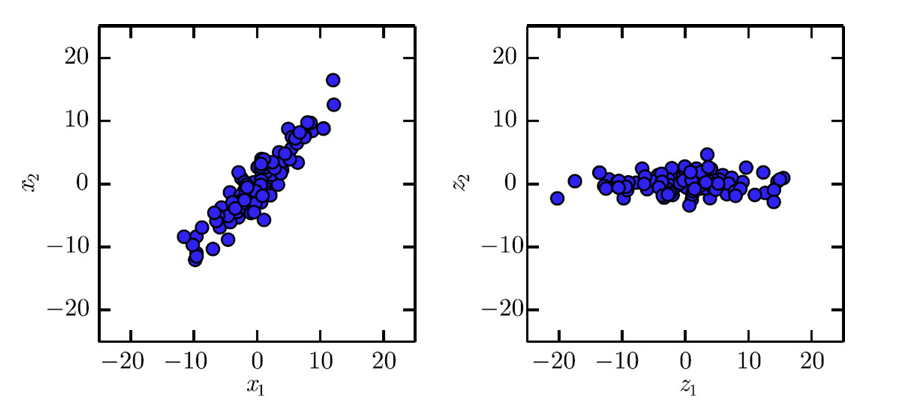

主成分分析旨在寻找一种压缩方式，可以将高维信息编码（投影）到低维的同时不损失太多信息，即让投影后向量尽可能接近原向量。我们用线性变换来描述m个向量从n维到l维的编码：

对于所有输入向量 $X_{m* n}$ ，投影在编码后的空间中坐标：

$$
Z_{m*l}=X_{m*n}D_{n*l}
$$
D的列向量为编码后空间的基，规定D的列向量正交归一，即： $D^TD=I_l$ 

那么Z在原空间中坐标，即重构后的向量为：

$$
X'=ZD^T=XDD^T
$$
用Frobenius范数来衡量编码前后向量的距离，我们要优化D使这个距离最小：

$$
D^*=\arg\min_D ||X-XDD^T||_F^2
$$

$$
=\arg\min_D Tr((X-XDD^T)^T(X-XDD^T))
$$

$$
=\arg\min_D Tr(X^TX-DD^TX^TX-X^TXDD^T+DD^TX^TXDD^T)
$$

由于迹运算循环对称：

$$
D^*=\arg\min_D Tr(X^TX-2D^TX^TXD+D^TDD^TX^TXD)
$$
由于 $D^TD=I_l$ ：

$$
D^*=\arg\min_D Tr(X^TX-D^TX^TXD)
$$
由于只含X的项与D无关，不影响argmin的结果：

$$
D^*=\arg\min_D Tr(-D^TX^TXD)
$$

$$
=\arg\max_D Tr(D^TX^TXD)
$$

这个问题的结果可以通过对 $X^TX$ 特征分解得到。想象l=1的情况，使得 $d^TX^TXd$ 最大的d应当是 $X^TX$ 最大特征值对应的特征向量方向。拓展到l维，可以证明，D由 $X^TX$ 的前l个最大特征值对应的特征向量组成，也就是X的右奇异矩阵的前l列。

这个结论看起来很合理，把X看作一个由n个m维向量为基组成的空间，每个向量描述了所有组数据x在某一特征上的分布，而所谓主成分分析就是取变换到这个空间后的最主要的前l个基，也就是选择了权重（奇异值）最大的l个特征，这对应着右奇异矩阵的前l列。

进一步观察结果式：

$$
D^*=\arg\max_D Tr(D^TX^TXD)
$$
即：

$$
D^*=\arg\max_D Tr(Z^TZ)
$$
 即主成分分析是在优化数据在新空间的轴上的方差最大。这意味着最大方差方向总是与新空间的轴对齐，也就是说Z的协方差矩阵 $Z^TZ$ 应是对角的，这也说明投影后的特征之间彼此没有线性相关的表示。

计算Var[z]对角来验证：

$$
Var[z]=\frac{1}{m-1}Z^TZ
$$

$$
=\frac{1}{m-1}D^TX^TXD
$$

将X奇异值分解： $X_{m* n}=U_{m* m}\Sigma_{m* n} V^T_{n* n}$ 

$$
Var[z]=\frac{1}{m-1}D^TV\Sigma^T U^TU\Sigma V^T D
$$
其中 $U^TU=I_m$ ；由于D是V的前l列，所以 $D^TV=I_l$ ：

$$
Var[z]=\frac{1}{m-1}\Sigma^T \Sigma
$$
可以验证，Z的协方差矩阵是对角的。

